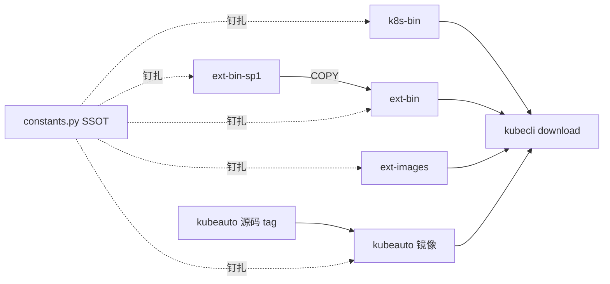

# 第 13 章 制品供应链与离线分发

## 13.1 六仓契约

| 仓库 | 镜像产物 | 内容 |
|------|----------|------|
| kubeauto | （逻辑） | CLI/roles/playbooks |
| kubeauto-dockerfile | `brinnatt/kubeauto` | 打包产品 |
| kubeauto-k8s-bin-dockerfile | `brinnatt/kubeauto-k8s-bin` | k8s 二进制 `/k8s` |
| kubeauto-ext-bin-dockerfile | `brinnatt/kubeauto-ext-bin` | etcd/containerd/helm/cfssl… |
| kubeauto-ext-bin-sp1-dockerfile | `brinnatt/kubeauto-ext-bin-sp1` | nginx/chrony/keepalived |
| kubeauto-ext-images-dockerfile | 各 `brinnatt/<组件>` | 生态镜像 |

CI dual-push：`hub.talkedu.cn/kubeauto/<name>:<tag>` 与 `brinnatt/<name>:<tag>`。契约测试：`tests/unit/test_six_repo_version_sync.py`。

## 13.2 控制节点下载管线

类与路径：

- `service/cluster/downloader.py` → `DownloadManager`
- `service/cluster/registry.py` → `RegistryManager`
- `service/cluster/docker.py` → `DockerManager`

`kubecli download -D`（`download_all`）顺序：

1. 如需则安装 Docker Engine（华为云静态包等）
2. 安装系统 Ansible（`common/mirrors.py`）
3. 抽取 kubeauto / k8s-bin / ext-bin 载体目录
4. 启动本地 Registry（`brinnatt/registry:2`，`registry.talkschool.cn:5000`，写 `/etc/hosts`）
5. 上传默认镜像集（calico×3、coredns、node-cache、metrics-server、pause）

拉取顺序：talkedu → Docker Hub →（少量）上游回落。推送：`registry.talkschool.cn:5000/brinnatt/...`。

`-E` 组件集合见 `KubeConstant.component_images`。

## 13.3 版本单一真相源（SSOT）

所有默认版本声明于 `common/constants.py` 的 `KubeConstant`。`ClusterManager._get_config_placeholders` 在 `kubecli new` 时把 `__k8s_ver__`、`__calico__`、`__pause__` 等写入集群 `config.yml`。

**禁止**仅在某一角色 YAML 中手写旧 tag——必然造成六仓漂移与离线失败。
