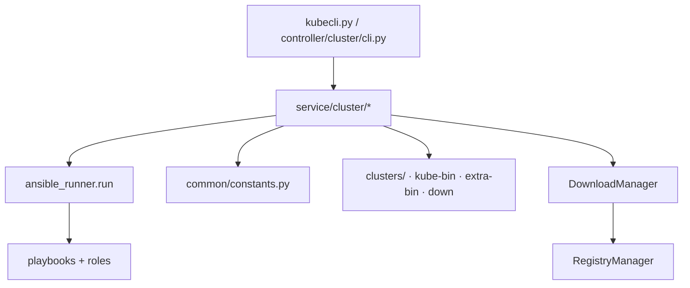

# 第 14 章 产品控制面软件架构（kubecli）

> 实现对照：`controller/cluster/cli.py`、`service/cluster/manager.py`、`service/cluster/downloader.py`  
> 操作入口：[操作手册](../operations-manual.md) §1.3

## 14.1 概述

**kubecli** 是 kubeauto 的产品控制面：在运维主机上提供集群生命周期、制品下载与库存管理的 CLI，通过 **ansible-runner** 调用 **ansible-playbook** 在目标节点执行 roles。Kubernetes 组件本身以 **二进制 + systemd** 运行，**不经过 kubeadm**；kubecli 负责编排安装顺序、注入变量与维护 `clusters/<name>/` 下的 PKI 与 kubeconfig 权威源。

## 14.2 分层架构

| 层 | 路径 | 职责 |
|----|------|------|
| CLI | `controller/cluster/cli.py` | 子命令解析、参数校验、shell 补全、交互确认 |
| service/cluster | `manager.py`、`downloader.py`、`registry.py`、`docker.py` | 集群 CRUD、playbook 调度、制品下载 |
| common | `constants.py`、`mirrors.py`、`ansible_python.py` | 版本 SSOT、镜像源、Ansible Python 解释器策略 |
| ansible | `playbooks/`、`roles/` | 节点落盘、systemd unit、证书分发 |

入口脚本：`kubecli.py`（开发树）或 PyInstaller 打包后的 `kubecli` 二进制（`brinnatt/kubeauto` 镜像内）。

## 14.3 CLI 子命令面

| 类别 | 子命令 | 说明 |
|------|--------|------|
| 集群创建 | `new <name>` | 从 `conf/` 复制 hosts/config 至 `clusters/<name>/` |
| 分步安装 | `setup <name> <step>` | 步骤 `01`…`07`、`90`、`10`、`11` 或别名 |
| 一键 AIO | `start-aio` | taskflow 编排实验环境（可 revert） |
| 生命周期 | `start` / `stop` / `upgrade` / `backup` / `restore` / `destroy` | 映射 91–95、99 playbook |
| 证书 | `kca-renew <name>` | 强制 CA 与全集群证书轮换（96） |
| 扩缩 | `add-etcd` / `add-master` / `add-node` 及对应 `del-*` | 21–23、31–33 |
| RBAC 用户 | `kcfg-adm` | 自定义客户端证书 kubeconfig |
| 制品 | `download` | `-D/-k/-b/-e/-X/-E/-H`（见第 13 章） |
| 运维 | `list`、`checkout`、`docker`、`system`、`version`、`completion` | 集群列表、上下文切换、Engine 辅助 |

所有面向集群的子命令均要求 `<cluster>` 对应 `clusters/<name>/` 已存在（`new` 除外）。

## 14.4 Setup 步骤与 Playbook 映射

`ClusterManager._PLAYBOOK_MAP_SETUP`（`service/cluster/manager.py`）：

| 步骤 | 别名 | Playbook | 内容摘要 |
|------|------|----------|----------|
| `01` | `prepare` | `01.prepare.yml` | chrony、podruntime.slice、基础目录 |
| `02` | `etcd` | `02.etcd.yml` | etcd 集群 |
| `03` | `container-runtime` | `03.runtime.yml` | containerd 或 docker+cri-dockerd |
| `04` | `kube-master` | `04.kube-master.yml` | apiserver、CM、scheduler、kube-lb |
| `05` | `kube-node` | `05.kube-node.yml` | kubelet、kube-proxy |
| `06` | `network` | `06.network.yml` | CNI（五选一） |
| `07` | `cluster-addon` | `07.cluster-addon.yml` | DNS、metrics-server、可选插件 |
| `90` | `all` | `90.setup.yml` | 上述步骤聚合（含互斥 when） |
| `10` | `ex-lb` | `10.ex-lb.yml` | 外置 keepalived + nginx LB |
| `11` | `harbor` | `11.harbor.yml` | Harbor 离线安装 |

**06 与 07 的分工**：步骤 **06** 仅安装 Pod 网络（CNI）；步骤 **07** 安装集群 DNS（CoreDNS、NodeLocal DNSCache）、metrics-server 及 `config.yml` 中启用的可选插件。该顺序保证 kubelet 在 CNI Ready 后再调度 DNS Pod，且 NodeLocal 清单依赖已知的 `CLUSTER_DNS_SVC_IP` 与 `PROXY_MODE`。

## 14.5 编排机制

### 14.5.1 常规 setup / 生命周期

`ClusterManager._run_playbook` 流程：

1. 在 `/dev/shm` 创建 ansible-runner 私有数据目录（避免污染产品目录）。  
2. 库存经 `_prepare_inventory_with_python` 注入各主机合适的 `ansible_python_interpreter`（含 RHEL8 Python 3.9 bootstrap 策略）。  
3. `extravars` 来自集群 `config.yml`，并注入 `REGISTRY_HOST_IP` 等运行时变量。  
4. `roles_path` 指向产品 `roles/`。  
5. PyInstaller 场景下恢复 `LD_LIBRARY_PATH`，避免调用系统 ansible 时动态库冲突。  
6. 调用 `ansible_runner.run(...)`，失败时抛出 `ClusterSetupError` / `ClusterManageError`。

**开发注意**：在开发机直接修改 roles 后，须同步至控制节点实际 `BASE_PATH`（例如 `sync-kubeauto.sh`），否则 runner 仍执行旧角色。

### 14.5.2 start-aio（taskflow）

`start-aio` 使用 **taskflow** `linear_flow` 包装 `SetupAIO` 任务类：

- 顺序执行 download（可选）、`new`、编辑提示、`setup 90` 等等价步骤。  
- `SetupAIO.revert`：仅当集群 **未** 被判定为 live 时执行 `99.clean` 并删除目录；若已 live 则 **拒绝** 自动销毁，防止误删生产。实验室 CI 须显式调用 `destroy`。

### 14.5.3 生命周期 Playbook 映射

`ClusterManager._PLAYBOOK_MAP_CLUSTER_COMMAND`：

| CLI | Playbook | 行为摘要 |
|-----|----------|----------|
| `start` | `91.start.yml` | 启动控制面与节点 systemd 单元 |
| `stop` | `92.stop.yml` | 停止上述单元 |
| `upgrade` | `93.upgrade.yml` | 二进制与配置滚动升级 |
| `backup` | `94.backup.yml` | etcd snapshot → `clusters/<name>/backup/` |
| `restore` | `95.restore.yml` | 自 snapshot 恢复（HA 安全停服顺序） |
| `destroy` | `99.clean.yml` | 清除集群组件与数据（不可逆） |

证书轮换 **`kca-renew`** 单独映射 `96.update-certs.yml`（非 `_PLAYBOOK_MAP_CLUSTER_COMMAND`），由 `ClusterManager.renew_ca_certs` 调用。

节点扩缩：

| 操作 | Playbook |
|------|----------|
| add etcd / master / node | `21.addetcd.yml` / `23.addmaster.yml` / `22.addnode.yml` |
| del etcd / master / node | `31.deletcd.yml` / `33.delmaster.yml` / `32.delnode.yml` |

## 14.6 集群目录与幂等

`kubecli new <name>` 行为：

- 复制 `conf/hosts.*` 模板与 `conf/config.yml` 至 `clusters/<name>/`。  
- 将 `__k8s_ver__`、`__calico__`、`__pause__`、`__prom_chart__` 等占位符替换为当前 `KubeConstant` 值。  
- **已存在集群不会自动重写 config**——版本升级须手工同步 `clusters/<name>/config.yml` 或按文档重建。

| 路径 | 性质 |
|------|------|
| `clusters/<name>/ssl/` | **PKI 权威源**（CA、各组件 CSR/PEM、kubeconfig） |
| `clusters/<name>/hosts` | Ansible 库存 |
| `clusters/<name>/config.yml` | 集群变量（extravars） |
| `clusters/<name>/backup/` | etcd snapshot（`backup` 生成） |
| `clusters/<name>/kubectl.kubeconfig` | 管理员 kubeconfig（`--embed-certs`） |

`sync-kubeauto.sh` **排除** `clusters/` 与 `*-bin/`，避免开发同步覆盖现场集群状态与已下载二进制。

## 14.7 配置占位符与常量注入

`_get_config_placeholders` 将 SSOT 中的版本与镜像 tag 写入新集群 config，例如：

- `__k8s_ver__` → `v1.33.6`  
- `__calico__` → `v3.28.4`  
- `__pause__` → `3.10`  
- `SANDBOX_IMAGE` → `registry.talkschool.cn:5000/brinnatt/pause:3.10`

运行时 play 读取 `clusters/<name>/config.yml` 与 inventory `[all:vars]`，**不**在 play 内硬编码版本。

## 14.8 与 Kubernetes API 的交互

部分管理操作（如节点就绪等待、升级前检查）通过 **kubernetes Python client** 读取集群状态（`manager.py` 内 `kubernetes` 包）。kubeconfig 路径默认为 `clusters/<name>/kubectl.kubeconfig`。该路径与 apiserver 证书 SAN、kube-lb 回环入口一致（见第 6、7 章）。

## 14.9 参考路径

| 主题 | 路径 |
|------|------|
| CLI 定义 | `controller/cluster/cli.py` |
| 集群管理 | `service/cluster/manager.py` |
| 下载 | `service/cluster/downloader.py` |
| 版本 SSOT | `common/constants.py` |
| Setup 聚合 | `playbooks/90.setup.yml` |
| 同步脚本 | `sync-kubeauto.sh` |
| 制品链 | 第 13 章 |
| 安全与生命周期 | 第 15 章 |
