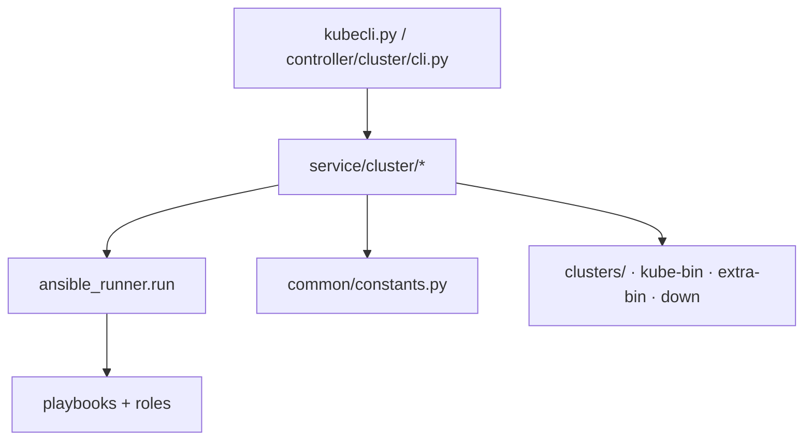

# 第 14 章 产品控制面软件架构（kubecli）

## 14.1 分层

| 层 | 职责 |
|----|------|
| CLI | 参数、子命令、补全、确认提示 |
| service | 下载、仓库、集群生命周期、库存改写 |
| common | 常量、镜像源、OS 探测、Ansible 解释器 |
| ansible | 真正在节点上落盘与启停 |

## 14.2 编排机制

- **常规 setup / 生命周期：** `ClusterManager._run_playbook` → **ansible-runner** 调用系统 `ansible-playbook`。
- **start-aio：** **taskflow** `linear_flow` 包装 `SetupAIO`（可 `revert` 清理）。

Setup step 映射见 `manager.py` 中 `_PLAYBOOK_MAP_SETUP`（`01`…`07`、`90`、`10`、`11`）。

## 14.3 集群目录与幂等

- `kubecli new <name>`：从 `conf/` 复制 hosts/config 到 `clusters/<name>/`
- 证书权威源：`clusters/<name>/ssl/`
- 运行时生成物：yml、kubeconfig 等
- `sync-kubeauto.sh` **排除** `clusters/` 与 `*-bin/`，避免开发同步冲掉现场状态

## 14.4 生命周期映射

| CLI | Playbook |
|-----|----------|
| start/stop | 91/92 |
| upgrade | 93 |
| backup/restore | 94/95 |
| kca-renew | 96 |
| destroy | 99 |
| add/del node\|master\|etcd | 21–23 / 31–33 |

## 14.5 `_run_playbook` 运行时细节

`ClusterManager._run_playbook`（`service/cluster/manager.py`）：

1. 在 `/dev/shm` 创建 ansible-runner 私有数据目录。  
2. 库存经 `_prepare_inventory_with_python` 注入合适 ansible_python_interpreter。  
3. `extravars` 来自集群 `config.yml`，并注入 `REGISTRY_HOST_IP`。  
4. `roles_path` 指向产品 `roles/`。  
5. PyInstaller 场景下恢复 `LD_LIBRARY_PATH`，避免调用系统 ansible 时动态库冲突。  

这意味着：**开发机直接改 roles 后，必须同步到控制节点实际 `BASE_PATH`**，否则 runner 仍用旧角色。

## 14.6 配置占位符替换

`kubecli new` 时 `_get_config_placeholders` 将 `__k8s_ver__`、`__calico__`、`__pause__`、`__prom_chart__` 等替换为 `KubeConstant` 当前值。  
已存在的集群不会自动重写——升级版本时要同步编辑 `clusters/<name>/config.yml` 或重建集群配置。

## 14.7 AIO 回滚语义

`SetupAIO.revert`：仅当集群**未**被判定为 live 时执行 `99.clean` 并删除目录；若已 live 则拒绝自动销毁，防止误删生产。实验室自动化需显式 `destroy`。

