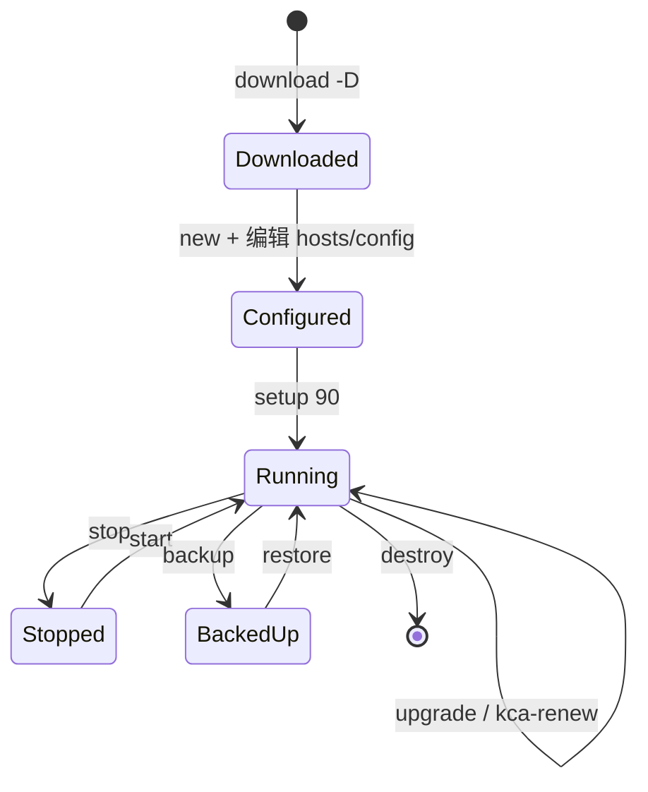

# 第 15 章 安全基线与运维生命周期

## 15.1 安全基线（交付检查）

1. **PKI：** CA 私钥仅 master；`clusters/*/ssl` 按密钥保管；定期演练 `kca-renew`。
2. **密钥与口令：** Grafana/MinIO/Dashboard 初始口令必须在交接后修改。
3. **网络：** apiserver 6443、etcd 2379/2380 仅对可信网络开放；kube-lb 仅回环监听。
4. **镜像：** 生产节点应只信任本地 Registry；禁止运行时随机拉最新 tag。
5. **RBAC：** 自定义用户走 `kcfg-adm` + 最小权限绑定，避免全员 `system:masters`。
6. **审计：** 需要合规时打开 `ENABLE_CLUSTER_AUDIT` 并外接日志系统。
7. **资源：** 坚持 Node Allocatable 合同默认；监控栈单独评估容量。

## 15.2 生命周期状态机

## 15.3 与操作手册的衔接

具体命令、库存示例、插件开关逐步说明见 [运维操作手册](../operations-manual.md)。本章只固定「安全与生命周期原则」；现场操作不得与原则冲突（例如销毁前未备份、轮换证书时跳过 etcd health）。

## 15.4 威胁模型（简表）

| 威胁 | 影响 | 缓解（本项目能力） |
|------|------|--------------------|
| 窃取 ca-key.pem | 伪造任意组件身份 | 仅 master 持有；文件系统权限；备份加密 |
| 窃取 admin kubeconfig | 集群完全控制 | 文件权限；独立运维主机；短时凭证 |
| 节点被入侵 | 可能窃取该节点 kubelet 证与业务密钥 | 缩小 Node 权限面；网络隔离；及时封禁 Node |
| 镜像投毒 | 供应链攻击 | 仅用本地 Registry；钉扎 tag；六仓构建可控 |
| 资源耗尽 | 控制面不可用 | Node Allocatable；监控；限流与配额（可扩展） |

## 15.5 交接签收建议清单（文档+现场）

1. 白皮书分章已评审（至少 2、3、6、7、9、11、12、15）。  
2. 操作手册完成 aio + HA 各一次安装记录。  
3. 证书矩阵抽检（§6.6 表）。  
4. `verify-node-reserved.sh` 通过。  
5. backup/restore 演练记录。  
6. 监控（若购买范围内）Grafana/告警通路记录。  
7. 初始口令修改记录。  
8. 版本矩阵与现场 `constants`/镜像 tag 一致。  

