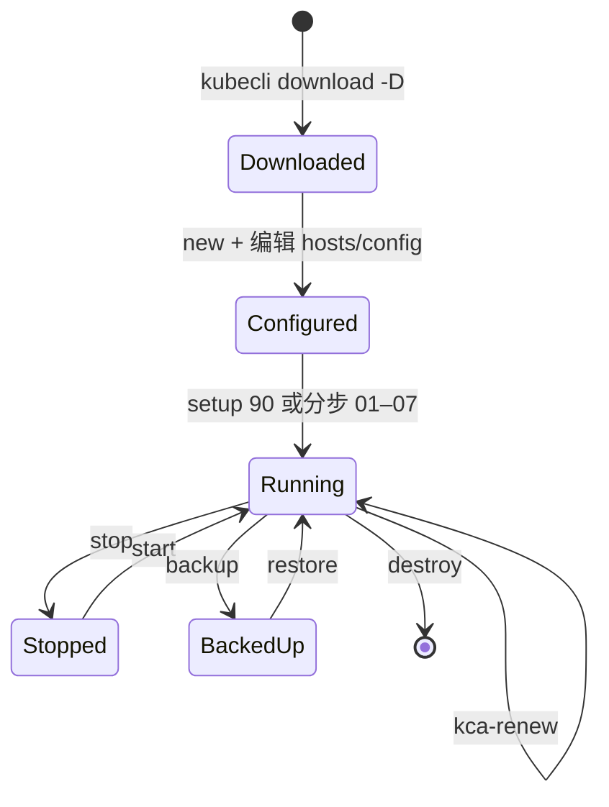
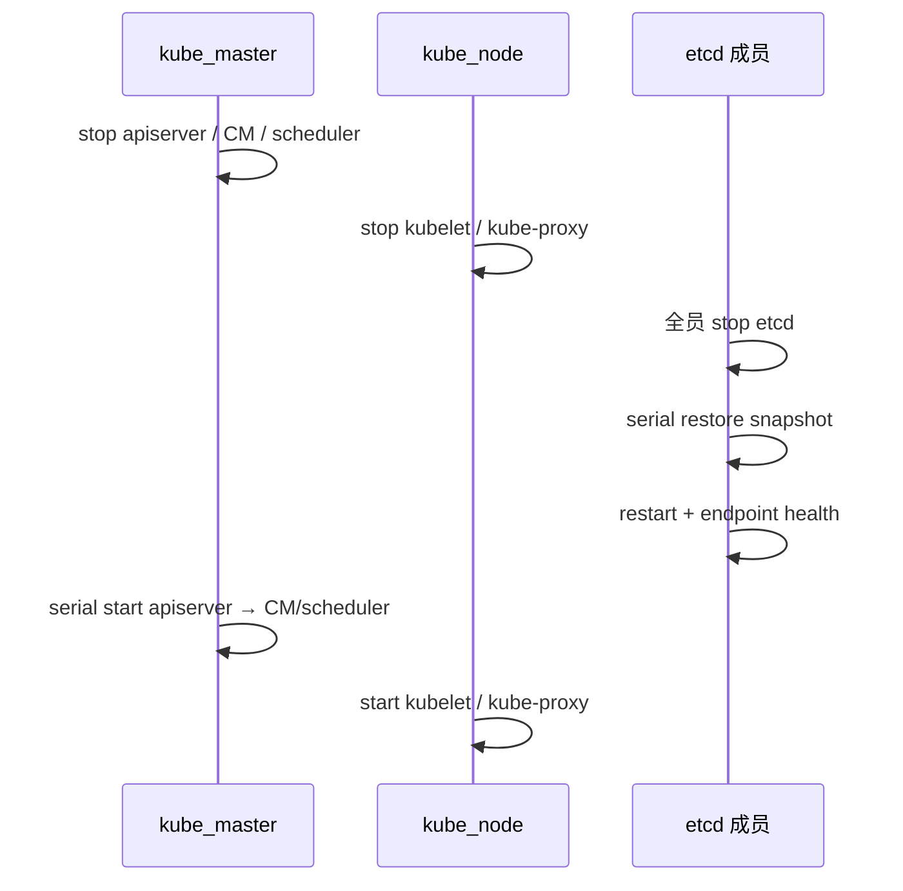

# 第 15 章 安全基线与运维生命周期

> 证书细节：[第 6 章](./06-pki-certificates.md) · 操作命令：[操作手册](../operations-manual.md) §1.3  
> 制品与镜像信任：第 13 章 · Node Allocatable：第 11 章

## 15.1 概述

本章固定 kubeauto 交付的 **安全基线** 与 **运维生命周期** 原则：PKI 保管、网络暴露面、镜像来源、RBAC、资源预留，以及 download → setup → 运行 → 备份 / 轮换 / 销毁的状态转换。具体命令与库存示例见操作手册；现场操作不得与下列原则冲突（例如销毁前未备份、证书轮换时跳过 etcd 健康检查）。

本项目 **不使用 kubeadm**；证书由 **cfssl** 显式签发，生命周期由 `kubecli` 子命令与对应 playbook 驱动。

## 15.2 安全基线（交付检查）

### 15.2.1 PKI 与密钥

| 项 | 要求 |
|----|------|
| CA 私钥 | `ca-key.pem` **仅**分发至 `kube_master`；纯 worker / 纯 etcd 节点不得持有 |
| 权威源 | `clusters/<name>/ssl/` 按密钥级保管；权限 `0600` 级 kubeconfig |
| 泄露响应 | admin kubeconfig 或 CA 私钥泄露须执行 `kubecli kca-renew <cluster>`（见 §15.5） |
| 轮换演练 | 交付验收应至少文档化一次 `kca-renew` 流程或等效桌面推演 |

### 15.2.2 口令与 RBAC

| 项 | 要求 |
|----|------|
| 初始口令 | Grafana、MinIO、Dashboard 等组件初始口令 **交接后必须修改** |
| 管理员访问 | 自定义用户经 `kubecli kcfg-adm` 签发客户端证书，绑定 **最小权限** ClusterRole |
| break-glass | 避免全员长期使用 `system:masters` / admin 证书；高权限 token 须限制暴露面与有效期 |

### 15.2.3 网络暴露面

| 端口 / 服务 | 要求 |
|-------------|------|
| kube-apiserver | `6443` 仅对运维网段 / 可信网络开放 |
| etcd | `2379`/`2380` 仅集群成员与运维主机可达 |
| kube-lb | 默认 **仅** `127.0.0.1:6443` 监听；节点组件 kubeconfig 指向回环 |
| NodePort / Ingress | Dashboard、Grafana 等须限制源 IP 或改内网 Ingress |
| Registry | 生产节点应只信任 `registry.talkschool.cn:5000`（或甲方指定私仓） |

### 15.2.4 镜像与供应链

| 项 | 要求 |
|----|------|
| tag 钉扎 | 禁止运行时 `latest` 或未审计 tag；版本与 `common/constants.py` 一致 |
| 来源 | 节点 pull 路径为本地 Registry；制品经六仓 dual-push + `kubecli download`（第 13 章） |
| 审计 | 可选启用 `ENABLE_CLUSTER_AUDIT` 并将审计日志外接 SIEM |

### 15.2.5 资源与可用性

| 项 | 要求 |
|----|------|
| Node Allocatable | 坚持合同默认（合计约 **2 CPU + 4Gi** 预留；`SYS_RESERVED_ENFORCE=no`） |
| 监控栈 | 启用 kube-prometheus-stack 前须评估 Allocatable；避免错误 enforce `system.slice` 饿死 apiserver |
| DNS | 默认 NodeLocal **`169.254.20.10`**；NetworkPolicy 须放行 DNS 53/TCP+UDP |

## 15.3 生命周期状态机



| 状态 | 标志 | 说明 |
|------|------|------|
| Downloaded | `BASE_PATH`、Registry、默认镜像就绪 | 可 `new` |
| Configured | `clusters/<name>/` 存在且 hosts 已填 | 可 `setup` |
| Running | systemd 单元 active；节点 Ready | 可备份、升级、扩缩 |
| Stopped | `92.stop.yml` 停止服务 | 数据仍在；可 `start` |
| BackedUp | `clusters/<name>/backup/snapshot.db` 存在 | 可 `restore` 演练 |

## 15.4 备份与恢复

### 15.4.1 `kubecli backup <cluster>`

| 项 | 内容 |
|----|------|
| Playbook | `94.backup.yml` |
| 机制 | 在 healthy etcd 成员上执行 `etcdctl snapshot save` |
| 输出 | `clusters/<cluster>/backup/snapshot_<timestamp>.db` 与 `snapshot.db`（最新指针） |
| 前置 | 集群 Running；至少一个 etcd endpoint healthy |

备份 **仅** 捕获 etcd 数据面；PKI、inventory、config 须 separately 备份 `clusters/<name>/` 目录（含 `ssl/`）。

### 15.4.2 `kubecli restore <cluster>`

| 项 | 内容 |
|----|------|
| Playbook | `95.restore.yml` |
| HA 约束 | **所有** etcd 成员必须先 stop，再 **serial:1** 逐成员 restore，然后协同启动 |

恢复顺序（实现要点）：



违反「全员停 etcd 再 restore」可能导致成员数据分叉。恢复前须确认 snapshot 与 **当前** 集群成员列表兼容（见官方 etcd restore 文档）。

### 15.4.3 备份策略建议

| 类型 | 频率 | 保留 |
|------|------|------|
| etcd snapshot | 每日或变更前 | 按 RPO 保留多份 timestamp 文件 |
| `clusters/<name>/` 目录 | 每次变更 inventory/PKI | 与 snapshot 同期 |
| 异地 | 按合规 | 加密传输与存储 |

交付验收须留存至少一次 **backup → restore 演练** 记录（操作手册签收项）。

## 15.5 证书轮换（`kubecli kca-renew`）

| 项 | 内容 |
|----|------|
| CLI | `kubecli kca-renew <cluster>` |
| Playbook | `96.update-certs.yml` |
| 标志 | `CHANGE_CA=true`；ansible tag `force_change_certs` |

### 15.5.1 适用场景

- CA 或 admin kubeconfig 泄露  
- 证书到期前批量更换（默认 `CERT_EXPIRY` 较长，但仍须规划）  
- SAN 变更后需重签 apiserver / etcd 证书  

### 15.5.2 HA 安全顺序（禁止逐台立即重启）

若部分成员已加载新 CA、部分仍仅认旧 CA，将出现 etcd peer TLS 失败、apiserver 间歇 x509 错误，表现为「网络抖动」类假象。实现采用 **两阶段屏障**：

1. **localhost**：备份 `ssl` → `ssl-<timestamp>`；`deploy` 角色在 `CHANGE_CA=true` 下重建 CA 与各 kubeconfig。  
2. **etcd**：`ETCD_SKIP_RESTART=true` 分发新证 → **全员 stop** → **协同 restart** → `endpoint health`。  
3. **kube_master**：`KUBE_MASTER_SKIP_RESTART=true` 分发 → 停 apiserver/CM/scheduler → 按序启动并等待。  
4. **kube_node**：更新 kubelet 证书与配置；必要时滚动 CNI / addon 依赖证书的 Secret。  
5. **附加**：重建 `kubernetes-crb`；`cluster-addon` 重建 Prometheus `etcd-client-cert` 等 Secret。

完整时序见 [第 6 章 §6.11](./06-pki-certificates.md)。

### 15.5.3 轮换后验证

```bash
# etcd 集群健康
ETCDCTL_API=3 extra-bin/etcdctl endpoint health ...

# apiserver
kubectl --kubeconfig=clusters/<cluster>/kubectl.kubeconfig get nodes

# worker 无 ca-key
ansible -i clusters/<cluster>/hosts kube_node -m shell \
  -a 'test ! -e /etc/kubernetes/ssl/ca-key.pem && echo OK'
```

## 15.6 销毁（`kubecli destroy`）

| 项 | 内容 |
|----|------|
| Playbook | `99.clean.yml` |
| 范围 | kube_master、kube_node、etcd、ex_lb；`roles/clean` |
| 数据 | **不可逆** 清除 Pod、etcd 数据、本地 kubernetes 目录等 |

**前置要求**：

1. 确认已完成 etcd 与 `clusters/<name>/` 备份（若数据须保留）。  
2. 确认无其他环境依赖该集群 API 或 Registry 唯一副本。  
3. 生产环境须二次确认（CLI 交互或变更流程）。

`start-aio` 的 `revert` **不会** 销毁已 live 集群；仅实验室未 live 场景可自动清理。

## 15.7 升级与启停

| CLI | Playbook | 说明 |
|-----|----------|------|
| `upgrade` | `93.upgrade.yml` | Kubernetes 二进制与配置；须先 `download -b/-k` 更新制品 |
| `start` / `stop` | `91` / `92` |  systemd 级启停；不删除数据 |

升级与证书轮换 **独立**：常规升级不替换 CA；`kca-renew` 不替代版本升级 playbook。

## 15.8 威胁模型

| 威胁 | 影响 | 缓解（本项目能力） |
|------|------|--------------------|
| 窃取 `ca-key.pem` | 伪造任意组件身份 | 仅 master 持有；文件系统权限；备份加密 |
| 窃取 admin kubeconfig | 集群完全控制 | 权限 `0600`；独立运维主机；泄露后 `kca-renew` |
| 节点被入侵 | 窃取 kubelet 证与业务 Secret | 缩小 Node 权限；NetworkPolicy；隔离与封禁节点 |
| 镜像投毒 | 供应链攻击 | 仅本地 Registry；钉扎 tag；六仓 CI dual-push |
| 资源耗尽 | 控制面不可用 | Node Allocatable；监控；Quota（可扩展） |
| 错误 restore | 数据丢失或集群分裂 | 演练流程；restore 前全员停 etcd |

## 15.9 交接签收建议清单

1. 白皮书分章已评审（至少 2、3、6、7、9、11、12、13、15）。  
2. 操作手册完成 AIO 与 HA 各一次安装记录。  
3. 证书矩阵抽检（第 6 章 §6.6）。  
4. `verify-node-reserved.sh` 输出 `RESERVED_ALLOCATABLE_PASS`。  
5. **backup / restore** 演练记录（含 snapshot 路径与时间戳）。  
6. **kca-renew** 流程文档或桌面推演记录。  
7. 监控（若在交付范围）Grafana / Alertmanager 通路记录。  
8. 初始口令修改记录（Grafana、MinIO、Dashboard 等）。  
9. 版本矩阵与现场 `constants.py` / 镜像 tag / `kubectl get pods -A` 抽检一致。  
10. Calico **etcdv3** 模式与 `calicoctl` 路径已交底（非 KDD；见第 9 章）。

## 15.10 参考路径

| 主题 | 路径 |
|------|------|
| 证书轮换 playbook | `playbooks/96.update-certs.yml` |
| 备份 / 恢复 | `playbooks/94.backup.yml`、`95.restore.yml` |
| 销毁 | `playbooks/99.clean.yml` |
| 集群管理 | `service/cluster/manager.py` |
| PKI 角色 | `roles/deploy/` |
| 操作手册生命周期表 | `docs/operations-manual.md` §1.3.3 末表 |
