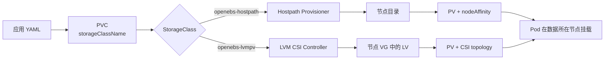
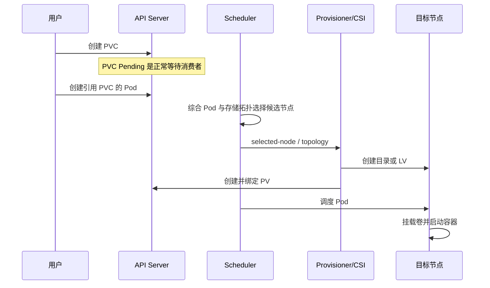
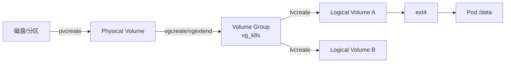
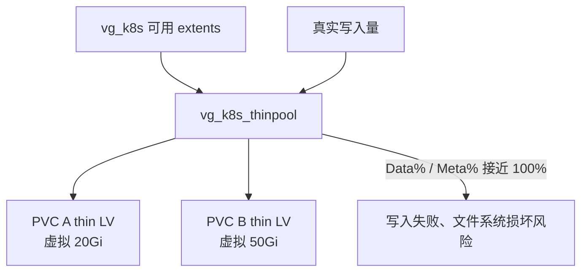
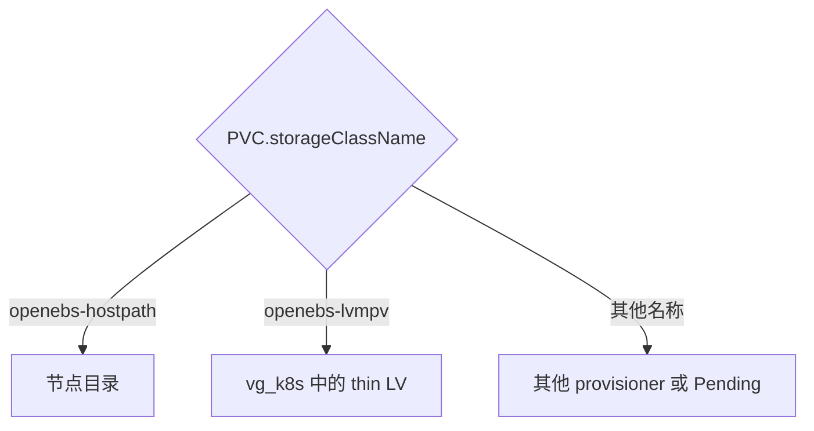

# 第 16 章 持久化存储与 OpenEBS

> **适用版本：** Kubernetes v1.33.6、OpenEBS umbrella chart 4.3.2、Local PV Hostpath 4.3.0、Local PV LVM 1.7.0  
> **项目实现：** `roles/cluster-addon/tasks/openebs.yml`、`roles/cluster-addon/templates/openebs/`、`conf/config.yml`  
> **操作步骤：** [操作手册 §1.3.4](../operations-manual.md#134openebs-生产运维)

## 16.1 本章解决什么问题

OpenEBS 不是一个单一的“网络硬盘”。它是一组 Kubernetes 存储引擎的集合。同一套 OpenEBS Helm chart 可以安装本地 Hostpath、LVM、ZFS 以及复制型 Mayastor 等不同数据引擎；这些引擎的故障域、容量管理和适用场景完全不同。

kubeauto 当前只启用其中两条本地存储路径：

| 引擎 | 项目 StorageClass | 后端 | Provisioner | 当前状态 |
|------|-------------------|------|-------------|----------|
| Local PV Hostpath | `openebs-hostpath` | 节点文件系统目录 | `openebs.io/local` | 安装 OpenEBS 时始终启用 |
| Local PV LVM | `openebs-lvmpv` | 节点 LVM VG/LV | `local.csi.openebs.io` | 由 `openebs_lvm_enabled` 控制 |
| Local PV ZFS | 无 | ZFS pool | CSI | 项目显式禁用 |
| Replicated PV Mayastor | 无 | 多节点复制块存储 | CSI + io-engine | 项目显式禁用 |

因此必须先给出边界结论：**本项目的两种 OpenEBS 卷都是节点本地卷，不自带跨节点数据副本，也不是共享存储。** 节点永久损坏时，Pod 不能仅靠漂移到其他节点恢复数据；生产业务必须另配应用副本、备份恢复或外部复制型存储。

## 16.2 Kubernetes 持久化对象如何协作

| 对象 | 谁创建 | 作用 |
|------|--------|------|
| StorageClass（SC） | 平台管理员 | 指定由哪个 provisioner、以哪些参数创建卷 |
| PersistentVolumeClaim（PVC） | 应用 | 声明容量、访问模式和要使用的 SC |
| PersistentVolume（PV） | Provisioner 动态创建 | 表示实际后端卷，并记录节点亲和性 |
| Pod | 应用 | 通过 PVC 使用卷，不直接依赖宿主机路径或 VG 名 |



PVC 只能指定一个 `storageClassName`，所以一次供给只会走其中一条路径。两种 SC 同时存在不代表同一份数据写入两个后端，也不会相互覆盖。

## 16.3 `WaitForFirstConsumer` 为什么关键

两个项目 SC 都使用或继承 `volumeBindingMode: WaitForFirstConsumer`。其作用是延迟创建/绑定 PV，直到出现真正使用 PVC 的 Pod，届时存储与 Pod 的 CPU、内存、污点、亲和性和节点拓扑可以一起决策。



若只创建 PVC 而没有消费者，PVC 可能长期 `Pending`，这不是故障。排障必须同时查看 PVC、Pod 和事件。

## 16.4 Local PV Hostpath 架构

### 16.4.1 工作原理

Hostpath provisioner 在 Pod 被选中的节点上，以 `openebs_hostpath` 为基目录，为每个 PV 创建独立子目录。项目默认基目录是 `/var/openebs/local`。

```mermaid
flowchart TB
  subgraph control[控制面]
    PVC[PVC]
    PROV[openebs-localpv-provisioner<br/>4.3.0]
    API[API Server]
    PVC --> API --> PROV
  end
  subgraph nodeA[节点 A]
    HELPER[linux-utils helper Pod]
    DIR[/var/openebs/local/pvc-...]
    POD[业务 Pod /data]
    HELPER -->|mkdir/chown| DIR
    DIR -->|hostPath mount| POD
  end
  PROV --> HELPER
  PROV --> PV[PV: nodeAffinity=节点 A]
  PV --> POD
```

项目映射：

| 配置 | 默认值 | 作用 |
|------|--------|------|
| `openebs_hostpath` | `/var/openebs/local` | 所有 Hostpath PV 的节点基目录 |
| `openebs_hostpath_storage_class` | `openebs-hostpath` | SC 名称 |
| LocalPV provisioner 镜像 | `brinnatt/provisioner-localpv:4.3.0` | 动态创建 PV 与 helper Pod |
| helper 镜像 | `brinnatt/linux-utils:4.2.0` | 在目标节点创建/清理目录 |

### 16.4.2 优点与限制

| 维度 | 行为 |
|------|------|
| 前置存储 | 不需要 LVM VG；基目录不存在时 provisioner 可创建 |
| 性能 | 直接使用节点文件系统，路径短、开销低 |
| 容量隔离 | 项目未配置 XFS project quota；PVC 容量不是目录的强制硬配额 |
| 扩容 | 扩大 PVC 不会自动扩大一块独立块设备，实质仍受节点文件系统剩余空间约束 |
| 故障域 | 单节点；PV 带节点亲和性 |
| 访问模式 | 典型为 `ReadWriteOnce`；不是跨节点 RWX 共享盘 |
| 数据清理 | SC 为 `Delete` 时，删除 PVC 会触发后端目录清理；重要数据删除前必须备份 |

它适合开发测试、缓存、可重建数据、应用自身已有副本的本地数据，也可用于明确接受节点故障域的生产工作负载。它不应被表述成“高可用存储”。

## 16.5 Local PV LVM 架构

### 16.5.1 Linux LVM 基础



OpenEBS LVM 不会替客户创建 PV/VG。官方 v1.7.0 前置条件要求节点安装 LVM2、加载 `dm_snapshot`；thin volume 还依赖 `dm_thin_pool`。kubeauto 的 prepare 角色会安装 `lvm2` 并加载这两个模块，但**不会选择或初始化客户磁盘，也不会创建 `vg_k8s`**，以避免误格式化生产数据盘。

### 16.5.2 CSI 组件

```mermaid
flowchart TB
  subgraph controller[LVM Controller Deployment]
    EP[csi-provisioner]
    RS[csi-resizer]
    SS[csi-snapshotter]
    SC[snapshot-controller]
    CD[lvm-driver controller]
    EP & RS & SS --> CD
  end
  subgraph each[每个运行 LVM 插件的节点]
    REG[csi-node-driver-registrar]
    ND[lvm-driver node<br/>privileged]
    DEV[/dev + kubelet mount propagation]
    REG --> ND --> DEV
    VG[vg_k8s] --> DEV
  end
  CD -->|创建 LVMVolume CR| API[API Server]
  API --> ND
  ND -->|vgs/lvcreate/lvremove| VG
  ND -->|回报 LVMNode/VG 容量| API
  API --> CD
```

控制器根据各节点 `LVMNode` 自定义资源中上报的 VG 和空闲容量选择节点；节点插件在真实宿主机上执行 LVM 操作并完成 kubelet 挂载。当前 chart 开启 CSI storage capacity tracking，默认调度算法是 `SpaceWeighted`，优先空闲空间更多的合格节点。

### 16.5.3 项目 StorageClass 的真实语义

渲染自 `roles/cluster-addon/templates/openebs/sc.yaml.j2`：

| 字段 | 当前值 | 含义 |
|------|--------|------|
| `provisioner` | `local.csi.openebs.io` | 请求交给 OpenEBS LVM CSI |
| `storage` | `lvm` | LVM 后端 |
| `volgroup` | `openebs_lvm_vg`，默认 `vg_k8s` | 精确匹配 VG 名 |
| `vgpattern` | `lvmvg.*` | 当前同时存在但不生效，见下文 |
| `thinProvision` | `yes` | 使用 LVM thin pool |
| `fsType` | `ext4` | 默认文件系统 |
| `allowVolumeExpansion` | `true` | 允许扩容，不允许缩容 |
| `reclaimPolicy` | `Delete` | PVC 删除后删除 LV |
| `volumeBindingMode` | `WaitForFirstConsumer` | 等待 Pod 后再按拓扑供给 |

OpenEBS v1.7.0 官方源码 `NewVolumeParams` 先读取 `vgpattern`，随后只要存在 `volgroup` 就将匹配表达式覆盖为 `^<volgroup>$`，即 **`volgroup` 优先**。因此当前项目的有效条件是：

```text
VG 名必须精确等于 vg_k8s
```

`vgpattern: "lvmvg.*"` 在当前模板中是冗余字段，不会扩大或改变候选 VG。开发者修改这里时必须以 v1.7.0 参数优先级为准。

### 16.5.4 thin provisioning 原理与风险

普通 thick LV 创建时立即从 VG 分配完整容量。thin provisioning 先建立 `<VG>_thinpool`，再创建逻辑容量可大于当前物理占用的 thin LV。



v1.7.0 源码不是“默认创建固定 10Gi thin pool”。首次 thin volume 到来且 pool 不存在时，驱动按请求容量与 VG 剩余空间计算初始 pool；pool 名固定为 `<VG>_thinpool`。后续 PVC 共用该 pool。

thin provisioning 可以超配，但不会创造物理容量。生产必须监控 `Data%`、`Meta%` 和 VG `VFree`，在阈值前扩容并验证 `dmeventd`/LVM autoextend 策略。**不能等到 100% 后才处理。**

## 16.6 两种 StorageClass 同时启用会冲突吗

不会自动冲突，原因有三：

1. 名称不同：`openebs-hostpath` 与 `openebs-lvmpv`。
2. Provisioner 不同：`openebs.io/local` 与 `local.csi.openebs.io`。
3. PVC 明确选择一个 `storageClassName`，一次只走一条供给链。



真正可能产生歧义的是“默认 StorageClass”。当前 kubeauto 没有把这两个 SC 标成默认类。客户若自行添加 `storageclass.kubernetes.io/is-default-class: "true"`，只应选择一个；不要把两个都设为默认。应用清单推荐始终显式写 `storageClassName`。

两者仍会竞争同一节点的底层资源：若 `/var/openebs/local` 所在文件系统和 `vg_k8s` 最终位于同一块物理盘，I/O、故障域和容量压力仍然共享。StorageClass 名称隔离不等于物理隔离。

## 16.7 `openebs_lvm_enabled` 与 VG 的关系

### 16.7.1 开关组合

| `openebs_install` | `openebs_lvm_enabled` | 实际结果 |
|-------------------|-----------------------|----------|
| `no` | 任意值 | OpenEBS 完全不安装；LVM 开关不生效 |
| `yes` | `no` | 只安装 Hostpath LocalPV；不装 LVM CSI，不创建 LVM SC |
| `yes` | `yes` | 同时安装 Hostpath 与 LVM CSI，并创建两个 SC |

`openebs_lvm_enabled: "yes"` 的含义只是“安装 LVM 引擎”，绝不表示自动创建 VG。

### 16.7.2 是否所有 Kubernetes 节点都要有 VG

分两种生产模型：

| 模型 | 要求 | 推荐度 |
|------|------|--------|
| 同构存储节点 | 所有允许承载 LVM 业务的节点都预建同名 `vg_k8s` | 默认、最易运维 |
| 部分存储节点 | 只有部分节点有 VG；SC 用 `allowedTopologies` 明确列出这些节点，业务也按该边界规划 | 支持，但必须显式治理 |

官方 v1.7.0 quickstart 明确说明：若 VG 只存在于部分节点，应使用 `allowedTopologies` 描述可用节点。当前 kubeauto 默认 LVM SC 没有启用该段，因此以下做法不能作为生产承诺：只在一半节点建 VG，却继续无条件使用默认 `openebs-lvmpv`。

### 16.7.3 一半节点有 VG 会怎样

LVM node DaemonSet 可以在无 VG 节点运行，并上报空 VG 列表；控制器和 SC 也可能显示正常。容量跟踪会尝试排除没有匹配 VG/容量的节点，但项目没有在安装阶段验证节点集合与 VG 集合一致，官方仍要求用 topology 声明部分节点模型。

未声明 topology 时可能出现：

- 大多数 PVC 正常落到有 `vg_k8s` 且空间足够的节点；
- 在容量信息尚未更新、节点标签/调度约束冲突或目标节点无合格 VG 时，PVC/Pod 长期 `Pending`；
- PVC 事件出现 provisioner 选不到节点或容量不足，LVM 控制器日志出现 scheduler/CreateVolume 失败；
- 强制 Pod 亲和到无 VG 节点时，不会回退成 Hostpath，也不会自动创建 VG。

正确处理见操作手册“部分节点提供 LVM”的自定义 SC。

### 16.7.4 所有节点都没有 VG 会怎样

| 观察项 | 表现 |
|--------|------|
| OpenEBS Hostpath | 仍可正常工作 |
| LVM Controller/Node Pod | 可能仍为 Running/Ready；这不证明数据面可供给 |
| `openebs-lvmpv` SC | 仍然存在 |
| LVM PVC | 无合格 VG，保持 Pending/反复 ProvisioningFailed |
| 依赖默认 LVM SC 的 MinIO/Nacos/RocketMQ | PVC 不绑定，业务 Pod 无法就绪 |

因此“Pod 全绿”和“StorageClass 存在”都不是 LVM 验收标准。必须完成真实 PVC `Bound`、Pod 挂载、写入、读取和删除回收验证。

## 16.8 选型矩阵

| 需求 | Hostpath | LVM | NFS/外部 RWX | 复制型/阵列存储 |
|------|----------|-----|--------------|-----------------|
| 无独立数据盘快速启用 | 合适 | 不合适 | 视外部服务 | 视外部服务 |
| 每 PVC 块设备边界 | 无 | 有 | 后端决定 | 有 |
| 在线扩容 | 目录无需块扩容，但无硬配额 | 支持增大 | 后端决定 | 通常支持 |
| thin provisioning | 无项目级硬隔离 | 当前默认开启 | 后端决定 | 后端决定 |
| 跨节点 RWX | 不支持 | 不支持 | 支持 | 视产品 |
| 节点故障自动读取同一数据 | 不支持 | 不支持 | 服务正常时支持 | 复制正常时支持 |
| 快照 | 项目未交付 Hostpath 快照链 | CSI/LVM 能力存在，但项目未完成客户快照 SOP 验收 | 后端决定 | 通常支持 |
| 推荐用途 | 测试、缓存、可重建/应用自复制数据 | 有磁盘治理的本地数据库、消息/对象组件 | 共享文件 | 平台级高可用数据 |

MinIO、Nacos、RocketMQ 是否能依赖本地卷，不由 OpenEBS 单独决定。必须把应用自身副本数、反亲和、故障恢复方式与本地卷节点亲和一起评审。

## 16.9 版本与制品关系

OpenEBS umbrella chart 的版本不等于每个子组件镜像版本：

| 层 | 项目版本 | 官方 4.3.2 chart 依赖/默认 |
|----|----------|----------------------------|
| OpenEBS umbrella chart | 4.3.2 | appVersion 4.3.2 |
| localpv-provisioner chart/image | 4.3.0 | 4.3.0 |
| lvm-localpv chart/driver | 1.7.0 | 1.7.0 |
| linux-utils helper | 4.2.0 | 4.2.0 |
| CSI sidecars | 项目显式钉扎 | 见附录 A |

所以部署 `openebs-4.3.2.tgz` 时看到 `provisioner-localpv:4.3.0` 是官方依赖关系，不是漏升级。项目将这些上游镜像重打为 `brinnatt/*` 并经本地 Registry 分发，但不改变组件语义。

## 16.10 安全、备份与生命周期边界

- LVM node 插件需要 privileged、访问宿主机 `/dev`，并使用 kubelet mount propagation；必须限制谁能修改其 DaemonSet、ServiceAccount 和镜像。
- Hostpath helper Pod 能操作宿主机基目录；基目录不得指向 `/`、`/etc`、运行时目录或其他共享敏感路径。
- 两类默认 SC 都采用 `Delete` 回收策略。删除 PVC 是数据删除操作，不是普通配置清理。
- etcd snapshot 只保存 PV/PVC 等 Kubernetes 元数据，不保存节点目录或 LV 中的业务数据。
- 备份必须覆盖“业务数据 + PV/PVC 清单 + 节点/VG 映射 + 恢复演练”。
- 本地 PV 的恢复目标受节点身份和后端数据位置约束；更换节点前必须设计数据迁移。

## 16.11 可观测性与容量指标

平台至少监控：

| 层 | 检查项 | 风险阈值示例 |
|----|--------|--------------|
| Kubernetes | PVC Pending、ProvisioningFailed、FailedMount | 任意持续事件即告警 |
| Hostpath | 基目录文件系统使用率/inode | 使用率按现场阈值，建议预警和严重两级 |
| LVM VG | `VFree`、VG 健康 | 可用量低于最大单卷需求前告警 |
| Thin pool | `Data%`、`Meta%`、seg_monitor | 必须在 100% 前扩容；阈值由容量策略确定 |
| OpenEBS | controller/node Ready、重启数、日志 | 非计划重启和非 Ready 告警 |
| 节点 | 磁盘错误、I/O latency、文件系统只读 | 立即告警 |

容量不是只看 PVC 申请量：Hostpath 需看真实文件系统；thin LVM 同时看虚拟分配量与 thin pool 实际占用。

## 16.12 客户问题直接回答

1. **为什么有两种？** Hostpath 解决“无需预建 VG、快速目录型本地卷”；LVM 解决“以 VG/LV 管理容量、隔离与扩容”。它们面向不同后端和运维能力。
2. **同时启用会冲突吗？** 不会。SC 名和 provisioner 均不同，PVC 显式二选一；但可能共享同一物理盘的容量与 I/O 故障域。
3. **启用 LVM 是否所有节点都必须预建 VG？** 默认同构模型应当在所有允许承载 LVM 业务的节点预建同名 VG。若只在部分节点提供，官方支持做法是给 SC 配置 `allowedTopologies`，明确限定节点。
4. **一半有、一半没有会怎样？** 组件可能全部 Ready，容量跟踪可能把卷安排到有 VG 节点，但当前项目不验证此边界；遇到调度约束或容量状态问题会 Pending。生产必须用 topology 明示，不依赖偶然成功。
5. **全部没有会怎样？** Hostpath 正常，LVM Pod/SC 可能看似正常，但任何 LVM PVC 都无法供给，依赖它的业务无法就绪。此时应设 `openebs_lvm_enabled: "no"`，或先完成磁盘与 VG 准备。
6. **OpenEBS 是高可用存储吗？** 本项目启用的 Hostpath/LVM 不是。OpenEBS 产品还包含复制型引擎，但 kubeauto 当前将 Mayastor 禁用，不能借用其能力描述本项目。

## 16.13 验收口径

OpenEBS 交付必须逐层验收：

1. Chart/镜像版本与本章矩阵一致。
2. Hostpath 与启用后的 LVM 组件 Ready，且无 ImagePull 错误。
3. SC 的 provisioner、回收策略、绑定模式与预期一致。
4. LVM 节点的 `LVMNode` 上报目标 VG 与容量；混合节点有明确 topology。
5. 每个交付 SC 都创建独立 PVC/Pod，完成 `Bound → mount → write → read`。
6. 验证 Pod 重建后数据仍在；验证节点故障时行为符合“本地卷”边界。
7. 验证 PVC 删除后的回收行为，并确认重要数据已有备份。
8. thin pool 和 Hostpath 文件系统已纳入容量告警。

项目当前企业矩阵已包含单节点 `vg_k8s` 上的 LVM 读写门禁；客户现场仍需按实际节点、磁盘、故障域和业务副本重新执行，实验室历史日志不能替代现场验收。

## 16.14 官方证据与项目路径

| 主题 | 官方/源码 |
|------|-----------|
| OpenEBS 4.3.x Hostpath 概览 | https://openebs.io/docs/4.3.x/user-guides/local-storage-user-guide/local-pv-hostpath/hostpath-overview |
| Hostpath StorageClass | https://openebs.io/docs/4.3.x/user-guides/local-storage-user-guide/local-pv-hostpath/configuration/hostpath-create-storageclass |
| OpenEBS 4.3.x LVM 概览 | https://openebs.io/docs/4.3.x/user-guides/local-storage-user-guide/local-pv-lvm/lvm-overview |
| LVM StorageClass | https://openebs.io/docs/4.3.x/user-guides/local-storage-user-guide/local-pv-lvm/configuration/lvm-create-storageclass |
| LVM v1.7.0 源码 tag | https://github.com/openebs/lvm-localpv/tree/v1.7.0 |
| Kubernetes StorageClass | https://kubernetes.io/docs/concepts/storage/storage-classes/ |
| Local Persistent Volumes | https://kubernetes.io/docs/concepts/storage/volumes/#local |
| CSI storage capacity | https://kubernetes.io/docs/concepts/storage/storage-capacity/ |

| 项目主题 | 路径 |
|----------|------|
| 开关与默认值 | `conf/config.yml` |
| Helm 安装任务 | `roles/cluster-addon/tasks/openebs.yml` |
| Chart values | `roles/cluster-addon/templates/openebs/values.yaml.j2` |
| LVM StorageClass | `roles/cluster-addon/templates/openebs/sc.yaml.j2` |
| 离线 chart | `roles/cluster-addon/files/openebs-4.3.2.tgz` |
| 镜像清单 | `common/constants.py` 的 `component_images["openebs"]` |
| 真实 LVM 门禁 | `tests/helpers/delivery-gap-retest.sh` |
| 实验室 VG helper | `tests/helpers/prep-node-lvm-loop.sh`（只用于测试，不是生产磁盘 SOP） |
