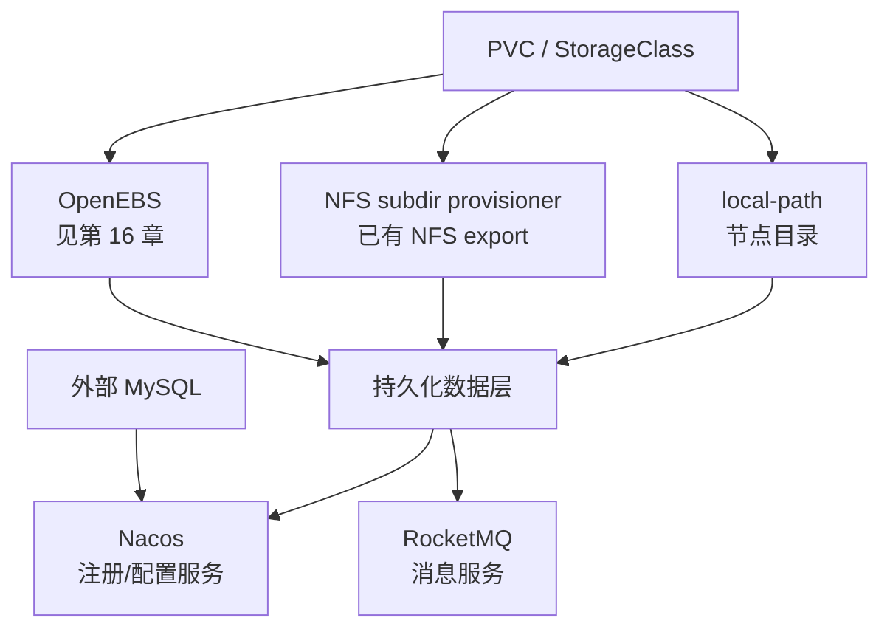
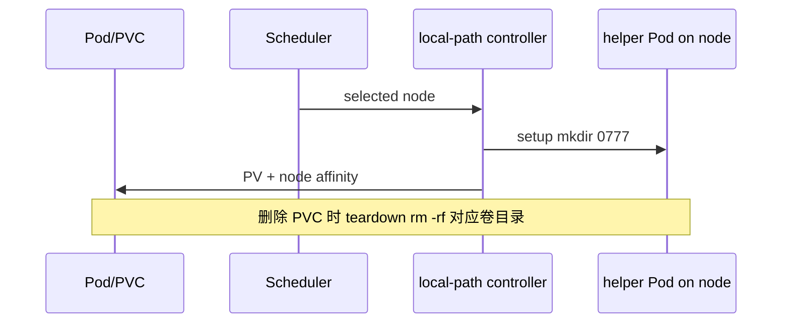
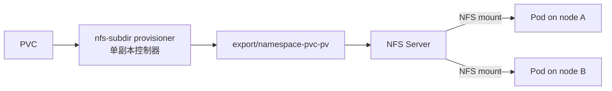
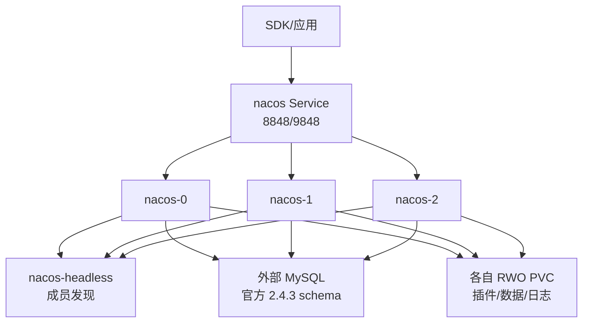
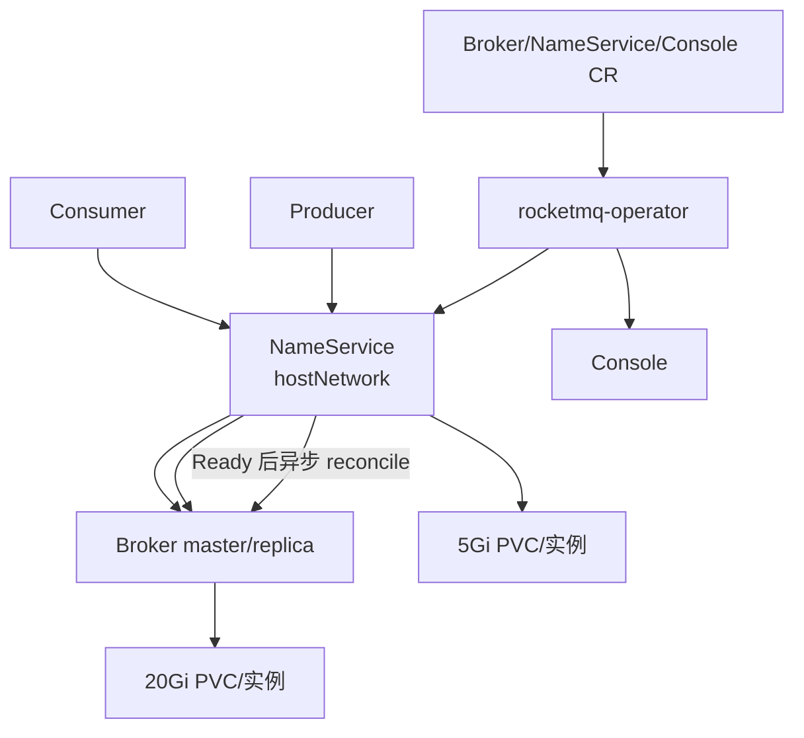

# 第 17 章 其他存储与中间件插件

> **适用版本：** local-path-provisioner v0.0.31、NFS Subdir External Provisioner v4.0.2、Nacos Server v2.4.3、RocketMQ Operator app 0.3.0  
> **实现入口：** `roles/cluster-addon/tasks/` 与 `roles/cluster-addon/templates/`  
> 本章只描述 kubeauto 实际启用的形态，不借用上游未启用能力。

## 17.1 四种能力不是同一层



local-path、NFS provisioner 和 OpenEBS 是存储供给方式；Nacos、RocketMQ 是消费存储与网络的中间件。业务组件 Pod Ready 之前，必须先验证其 StorageClass 数据面和外部依赖。

## 17.2 Rancher Local Path Provisioner

### 17.2.1 原理与项目实现

控制器监听 PVC，在被调度节点上启动 helper Pod，执行 ConfigMap 中的 setup/teardown 脚本创建或删除目录，再生成带节点约束的 PV。

| 项 | kubeauto 值 |
|----|-------------|
| 开关 | `local_path_provisioner_install`，默认 `no` |
| 版本 | v0.0.31 |
| Namespace | `kube-system` |
| SC | `local_path_storage_class`，默认 `local-path` |
| 节点目录 | `local_path_provisioner_dir` |
| Provisioner | `rancher.io/local-path` |
| 绑定/回收 | `WaitForFirstConsumer` / `Delete` |



官方 v0.0.31 明确说明当前不支持 volume capacity limit，请求容量会被忽略。它和 OpenEBS Hostpath 一样是本地故障域，但实现、SC 和 provisioner 不同；同时安装不冲突，PVC 必须显式选一个。

### 17.2.2 运维与验收

- 基目录不得是 `/` 或系统敏感路径；项目默认映射会允许所有未单列节点使用同一配置路径。
- 监控每个节点基目录所在文件系统的容量与 inode，不能只汇总 PVC requests。
- `Delete` 会执行 `rm -rf "$VOL_DIR"`；卸载 provisioner 前必须先处理其 PV。
- 验收必须完成 PVC Bound、写/读、Pod 重建数据仍在、PVC 删除后测试目录被清理。

```bash
kubectl -n kube-system get deploy,pod -l app=local-path-provisioner
kubectl get sc <local-path-storage-class> -o yaml
kubectl describe pvc <pvc>
kubectl -n kube-system logs deploy/local-path-provisioner --tail=200
```

## 17.3 NFS Subdir External Provisioner

### 17.3.1 原理与责任边界

该 provisioner **不提供 NFS 服务**。它把已经存在、已经导出的 `nfs_server:nfs_path` 挂到自身 `/persistentvolumes`，按 PVC 创建子目录并生成 PV。NFS 服务端的高可用、磁盘、配额、快照、备份、权限和网络仍由客户负责。



| 项 | kubeauto 值 |
|----|-------------|
| 开关 | `nfs_provisioner_install`，默认 `no` |
| 版本 | v4.0.2 |
| SC | `nfs_storage_class`，默认 `managed-nfs-storage` |
| Provisioner | `k8s-sigs.io/nfs-subdir-external-provisioner` |
| 后端 | `nfs_server` + `nfs_path` |
| 删除参数 | `archiveOnDelete: "false"` |

当前 `archiveOnDelete=false` 意味着删除 PVC 时不归档旧目录；配合 SC 默认 Delete 时应按数据删除操作管理。NFS 可提供跨节点访问，但可用性不高于 NFS 服务端本身。

### 17.3.2 前置与验收

每个可能运行业务 Pod 的节点必须安装 NFS client，并能解析/访问服务端。先做客户端数据面验证，再安装 provisioner：

```bash
showmount -e <nfs-server>
mount -t nfs <nfs-server>:<export> <approved-test-mountpoint>
touch <approved-test-mountpoint>/kubeauto-nfs-preflight
umount <approved-test-mountpoint>
```

现场还必须验证：PVC RWO/RWX 与应用声明一致、两个节点读写同一测试数据、删除策略符合合同、服务端备份可恢复。Provisioner Running 只说明控制器存活，不说明 NFS export 可写。

```bash
kubectl -n <nfs-namespace> get deploy,pod -l app=nfs-client-provisioner
kubectl get sc <nfs-storage-class> -o yaml
kubectl describe pvc <pvc>
kubectl -n <nfs-namespace> logs deploy/nfs-client-provisioner --tail=200
```

## 17.4 Nacos 2.4.3

### 17.4.1 架构



项目使用 StatefulSet、peer-finder initContainer、headless Service 和外部 MySQL。三副本采用 `requiredDuringSchedulingIgnoredDuringExecution` 主机反亲和，因此 `nacos_replicas: 3` 至少需要 3 个满足资源与存储约束的可调度节点；单节点不能通过简单等待变成三副本 Ready。

| 配置 | 含义/风险 |
|------|-----------|
| `nacos_mysql_*` | 外部 MySQL 连接；必须预导入仓库内官方 2.4.3 schema |
| `nacos_storage_class/size` | 每个 StatefulSet Pod 的 RWO PVC |
| `nacos_jvm_xms/xmx/xmn` | JVM 堆；Xms/Xmx 应结合容器/节点内存 |
| `nacos_mem_request/cpu_request` | 调度 requests，不等于 JVM 最大堆 |
| `nacos_replicas` | 服务副本数，受强反亲和约束 |
| 8848/9848/9849/7848 | HTTP、客户端 RPC、Raft/兼容通信端口 |

项目启用了 Nacos auth，但模板内初始 token/identity 属于交付初值，生产必须轮换并进入客户密码系统，不能沿用仓库值。

### 17.4.2 正确验收

1. MySQL 可达且 schema 表存在，不能回退成嵌入式数据库假通过。
2. StatefulSet 期望副本全部 Ready，PVC 全部 Bound，反亲和分布符合预期。
3. 通过 API/客户端创建配置，另一客户端读取；重建 Pod 后仍能读取。
4. 验证注册实例、健康检查和订阅通知，而不只打开控制台。
5. MySQL 备份恢复与 Nacos 配置/命名空间恢复完成演练。

```bash
kubectl -n nacos get sts,pod,pvc,svc -o wide
kubectl -n nacos describe pod <nacos-pod>
kubectl -n nacos logs <nacos-pod> -c nacos --tail=200
```

Pod Pending 优先检查反亲和、节点数、PVC/topology 和 requests；CrashLoop 优先检查 MySQL schema/认证、JVM 与外部数据库连接参数。

## 17.5 RocketMQ Operator

### 17.5.1 协调架构



项目 vendored chart `0.1.0` 的 appVersion 是 operator `0.3.0`；Broker/NameServer 为定制 `4.5.0-alpine-operator-0.3.0`，Console 为 `2.0.0`。`latest` operator 镜像是现有发布风险点，升级时必须通过六仓 digest/行为门禁，不能把 tag 当不可变版本。

| 配置 | 当前默认 | 真实含义 |
|------|----------|----------|
| `rocketmq_nameservice_size` | 1 | hostNetwork；多副本需要不同可用节点/端口 |
| `rocketmq_broker_size` | 1 | broker group 数 |
| `rocketmq_replica_per_group` | 0 | 每组只有 master，不是消息副本 HA |
| `rocketmq_broker_mem` | 512Mi heap | 应与 request/limit 和负载联合规划 |
| `rocketmq_storage_class` | OpenEBS LVM 变量 | Broker 与 NameService 都依赖 PVC |
| `flushDiskType` | `ASYNC_FLUSH` | 性能优先，主机故障可能丢失尚未刷盘消息 |
| `brokerRole` | `ASYNC_MASTER` | 当前默认不是同步复制承诺 |

这是异步 CR 协调：Operator 创建 CR 成功后，Broker 可能仍在等待 NameService 或 PVC；`kubectl apply` 返回 0 不是集群 Ready。

### 17.5.2 正确验收与故障分类

1. Operator Ready；NameService 达到期望副本；随后 Broker/Console Ready。
2. 所有 Broker/NameService PVC Bound，实际卷容量与故障域符合选型。
3. 创建 topic，生产带唯一 ID 的消息，消费者读到相同 ID，并核对消费进度。
4. 重建 Broker 后消息仍可消费；按合同验证 master/replica 故障，而不是只验证 Pod 重启。
5. JVM 无 OOMKilled，磁盘水位、积压、发送/消费失败和 broker 注册均有告警。

```bash
kubectl -n rocketmq get broker,nameservice,console
kubectl -n rocketmq get pod,pvc,svc -o wide
kubectl -n rocketmq describe broker broker
kubectl -n rocketmq logs deploy/rocketmq-operator --tail=200
```

| 现象 | 首查 |
|------|------|
| NameService 不足 | hostNetwork 端口、节点数、PVC、资源 |
| Broker 长期未创建 | NameService Ready 条件、Operator 日志、CR status |
| Broker Pending | StorageClass/PVC、节点 topology、内存 request |
| Broker OOMKilled | `BROKER_MEM` 与 container limit、节点压力 |
| Pod 全 Ready 但消息失败 | topic、路由注册、生产/消费客户端、积压与 broker 日志 |

## 17.6 统一安装顺序与验收链


任何一层失败都应停在本层修复并回收失败资源，不能通过放宽 Ready 检查把失败推给下一层。

## 17.7 官方来源与项目路径

| 组件 | 锁定版本官方来源 | 项目路径 |
|------|------------------|----------|
| local-path v0.0.31 | https://github.com/rancher/local-path-provisioner/tree/v0.0.31 | `templates/local-storage/` |
| NFS provisioner v4.0.2 | https://github.com/kubernetes-sigs/nfs-subdir-external-provisioner/tree/nfs-subdir-external-provisioner-4.0.2 | `templates/nfs-provisioner/` |
| Nacos 2.4.3 | https://github.com/alibaba/nacos/tree/2.4.3 | `templates/nacos/` |
| RocketMQ Operator | https://github.com/apache/rocketmq-operator | `templates/rocketmq/`、`rocketmq-operator-0.1.0.tgz` |
